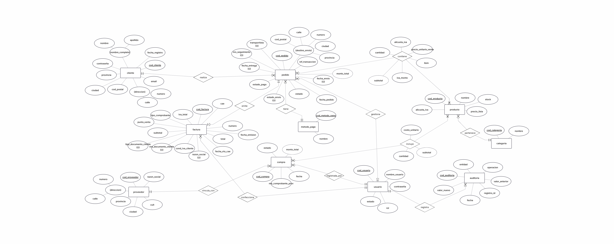
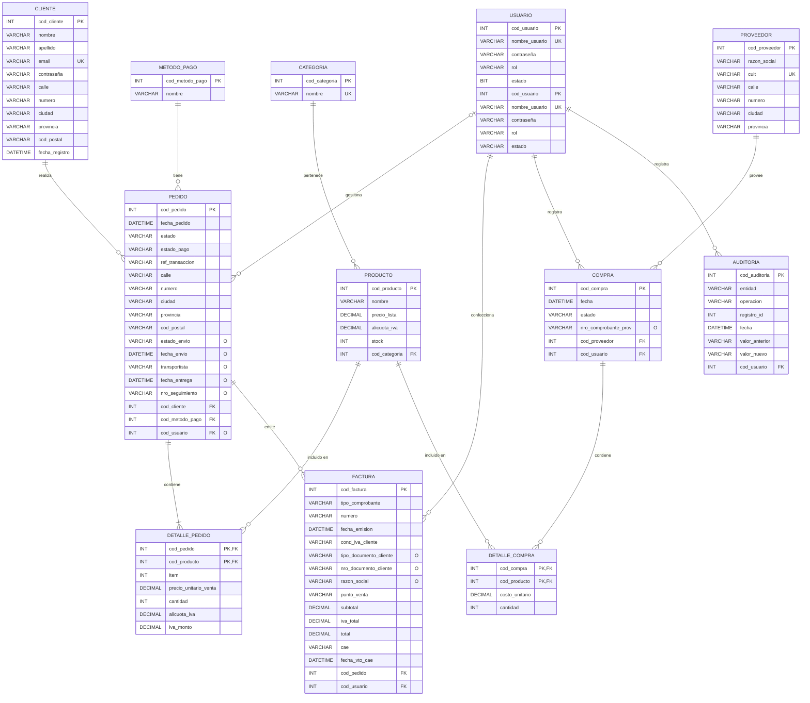

# Modelo Relacional

Transformación del Diagrama Entidad-Relación al modelo relacional, con notación de claves primarias (PK), claves foráneas (FK) y restricciones de unicidad (UQ).

## Reglas de mapeo aplicadas

El objetivo fundamental del mapeo es traducir los constructos de alto nivel del modelo ER/EER (entidades, atributos, relaciones) a las estructuras del modelo relacional: tablas (o relaciones), columnas (atributos), claves primarias y claves foráneas, y otras restricciones de integridad. Este es un proceso sistemático que se basa en un conjunto de reglas bien definidas.

Reglas seguidas para transformar el DER (notación de Chen) en el esquema relacional:

1. **Entidad fuerte**: Cada tipo de entidad fuerte en el diagrama ER/EER se mapea directamente a una tabla relacional. Los atributos simples de una tabla se convierten en columnas de la tabla. El identificador único o clave primaria de la entidad se designa como la clave primaria (PK) de la tabla relacional. 

2. **Atributo compuesto**: Cada componente simple del atributo se convierte en una columna separada en la tabla de entidad.

3. **Relaciones 1:N**: La clave primaria de la entidad que está en el lado "1" de la relación se añade como una clave foránea en la tabla de la entidad que está en el lado "N". 

4. **Relaciones M:N**: Este tipo de relaciones siempre se mapea a una nueva tabla relacional.
Esta nueva tabla tendrá como clave primaria la combinación de las claves primarias de las entidades participantes, las cuales también actuarán como claves foráneas referenciando sus respectivas tablas.

5. **Atributos de relación**: Si una relación en el modelo ER/EER tiene atributos propios (es decir atributos que describen a la relación en sí y no a las etidades participantes), estos se convierten en columnas de la tabla que representa la relación.

6. **Atributo derivado**: Los atributos derivados no se materializan como columnas. 

7. **Atributos opcionales**: Los atributos marcados "(O)/Optional" en el DER se mantienen como columnas que admiten valores nulos. 

En el DER propuesto para el sistema, las entidades fuertes que participan en el registro de un pedido son: cliente, pedido, metodo_pago, producto, categoria y usuario.

Los atributos compuestos del DER (nombre_completo, direccion, destino_envio) se descomponen en sus componentes simples como columnas independientes:
nombre_completo -> nombre + apellido, 
direccion -> calle + numero, 
destino_envio -> calle + numero + ciudad + provincia + cod_postal.

Relación 1:N -> clave foránea en el lado "N". La entidad del lado "muchos" incorpora como FK la clave primaria de la entidad del lado "uno":
categoria (1) — producto (N) -> producto.cod_categoria FK, 
cliente (1) — Pedido (N) -> pedido.cod_cliente FK, 
metodo_pago (1) — pedido (N) -> metodo_pago.cod_metodo_pago FK, 
usuario (1) — pedido (N) -> pedido.cod_usuario FK.

Relación N:M: La relación pedido — producto (`contiene`) pasa a ser la tabla `detalle_pedido`, cuya PK combina las FK de ambas entidades participantes(cod_pedido, cod_producto).

Atributos de la relación N:M detalle_pedido: Los atributos que colgaban del rombo de relación en el DER (cantidad, precio_unitario_venta, alicuota_iva, iva_monto, item en "contiene") pasan a ser columnas de detalle_pedido, ya que dependen funcionalmente de la combinación completa de ambas FK.

Los atributos marcados como "Derived" en el DER (monto_total de pedido y subtotal en la relación M:N) no se almacenan como columna física; se calculan en el momento de la consulta o mediante función/columna generada.

Los atributos marcados (O)/Optional en el DER (estado_envio, transportista, nro_seguimiento, fecha_envio, fecha_entrega) se mantienen como columnas que admiten valores nulos.

A continuación el detalle en tablas del mapeo de cada una de las entidades fuertes y relaciones con sus respectivos atributos,  implicadas en el registro de un pedido, especificando nombre de la tabla, restricciones PK y UQ, columnas y tipo de dato: 

## Tablas

### cliente
| Columna | Tipo Dato | Restricción |
|---|---|---|
| cod_cliente | INT | PK |
| nombre | VARCHAR | |
| apellido | VARCHAR | |
| email | VARCHAR | UQ |
| contraseña | VARCHAR | |
| calle | VARCHAR | |
| numero | VARCHAR | |
| ciudad | VARCHAR | |
| provincia | VARCHAR | |
| cod_postal | VARCHAR | |
| fecha_registro | DATETIME | |

### usuario
| Columna | Tipo Dato| Restricción |
|---|---|---|
| cod_usuario | INT | PK |
| nombre_usuario | VARCHAR | UQ |
| contraseña | VARCHAR | |
| rol | VARCHAR | |
| estado | BIT | |

### metodo_pago
| Columna | Tipo Dato| Restricción |
|---|---|---|
| cod_metodo_pago | INT | PK |
| nombre | VARCHAR | |

### pedido
| Columna | Tipo Dato| Restricción |
|---|---|---|
| cod_pedido | INT | PK |
| fecha_pedido | DATETIME | |
| estado | VARCHAR | |
| estado_pago | VARCHAR | |
| ref_transaccion | VARCHAR | |
| calle | VARCHAR | |
| numero | VARCHAR | |
| ciudad | VARCHAR | |
| provincia | VARCHAR | |
| cod_postal | VARCHAR | |
| estado_envio | VARCHAR | Opcional |
| fecha_envio | DATETIME | Opcional |
| transportista | VARCHAR | Opcional |
| fecha_entrega | DATETIME | Opcional |
| nro_seguimiento | VARCHAR | Opcional |
| cod_cliente | INT | FK -> cliente |
| cod_metodo_pago | INT | FK -> metodo_pago |
| cod_usuario | INT | FK -> usuario, Opcional |

### categoria
| Columna | Tipo Dato| Restricción |
|---|---|---|
| cod_categoria | INT | PK |
| nombre | VARCHAR | UQ|

### producto
| Columna | Tipo Dato| Restricción |
|---|---|---|
| cod_producto | INT | PK |
| nombre | VARCHAR | |
| precio_lista | DECIMAL | |
| alicuota_iva | DECIMAL | |
| stock | INT | |
| cod_categoria | INT | FK -> categoria |

### detalle_pedido
| Columna | Tipo Dato| Restricción |
|---|---|---|
| cod_pedido | INT | PK, FK -> pedido |
| cod_producto | INT | PK, FK -> producto |
| item | INT | |
| precio_unitario_venta | DECIMAL | |
| cantidad | INT | |
| alicuota_iva | DECIMAL | |
| iva_monto | DECIMAL | Calculada |

### proveedor
| Columna | Tipo | Restricción |
|---|---|---|
| cod_proveedor | INT | PK |
| razon_social | VARCHAR | |
| cuit | VARCHAR | UK |
| calle | VARCHAR | |
| numero | VARCHAR | |
| ciudad | VARCHAR | |
| provincia | VARCHAR | |

### compra
| Columna | Tipo | Restricción |
|---|---|---|
| cod_compra | INT | PK |
| fecha | DATETIME | |
| estado | VARCHAR | |
| nro_comprobante_prov | VARCHAR | Opcional |
| cod_proveedor | INT | FK → proveedor |
| cod_usuario | INT | FK → usuario |

### detalle_compra
| Columna | Tipo | Restricción |
|---|---|---|
| cod_compra | INT | PK, FK → compra |
| cod_producto | INT | PK, FK → producto |
| costo_unitario | DECIMAL | |
| cantidad | INT | |

### factura
| Columna | Tipo | Restricción |
|---|---|---|
| cod_factura | INT | PK |
| tipo_comprobante | VARCHAR | |
| numero | VARCHAR | |
| fecha_emision | DATETIME | |
| cond_iva_cliente | VARCHAR | |
| tipo_documento_cliente | VARCHAR | Opcional |
| nro_documento_cliente | VARCHAR | Opcional |
| razon_social | VARCHAR | Opcional |
| punto_venta | VARCHAR | |
| subtotal | DECIMAL | |
| iva_total | DECIMAL | |
| total | DECIMAL | |
| cae | VARCHAR | |
| fecha_vto_cae | DATETIME | |
| cod_pedido | INT | FK → pedido |
| cod_usuario | INT | FK → usuario |

### auditoria
| Columna | Tipo | Restricción |
|---|---|---|
| cod_auditoria | INT | PK |
| entidad | VARCHAR | |
| operacion | VARCHAR | |
| registro_id | INT | |
| fecha | DATETIME | |
| valor_anterior | VARCHAR | |
| valor_nuevo | VARCHAR | |
| cod_usuario | INT | FK → usuario |

## Diagrama relacional

